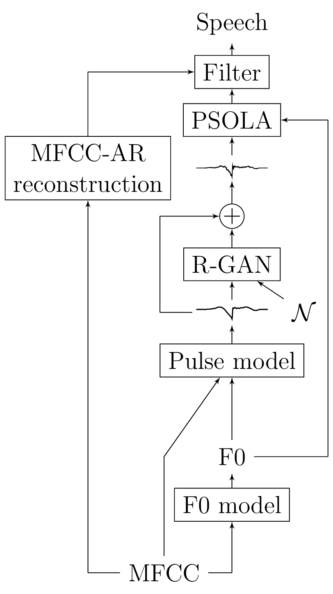
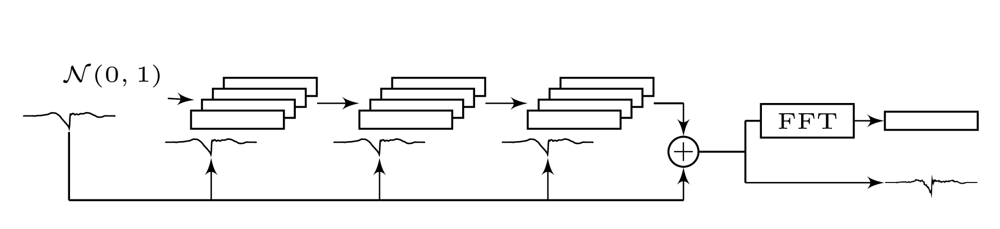

# MFCC residual waveform generation with GAN


This repository contains code related to our ICASSP 2018 paper https://arxiv.org/abs/1804.00920
 

Residual learning with generative adversarial networks is involved (hence the name ResGAN). For details, check the paper and model architecture section below.

Audio samples are available at http://tts.org.aalto.fi/mfcc_synthesis/.

## Requirements

Requirement versions are based on my experiment system, an there's no specific reason why the code wouldn't work on older versions

* python
* numpy >= 1.11.0
* scipy >= 0.17.0
* theano >= 0.9.0
* keras >= 2.0.2
* sklearn >= 0.18.2
* matplotlib >= 2.0.0
* librosa >= 0.5.1

## Training the models

Train the models by running
```
sh 00_make_dirs.sh
sh 00_get_data.sh
sh 01_run_train.sh
```

The script will first train a least-squares pulse model and freeze it before training the GAN noise model. While training, images of generated waveforms are saved in `figures` folder for qualitative inspection.

On a Titan X GPU, the pulse model takes about 10-15min per epoch. 
 
Note that for psola and filtering, GlottDNN vocoder is required (and will be released soon...). As such, with the currently available code the results are for visual inspection only. 

## Model architecture

All models are defined in `models.py`. 

<!-- 

-->

The generator architecture is fully convolutional and has two inputs: Gaussian noise and the smooth waveform given by the pulse model. Residual learning is enabled by catenating the pulse to each layer as an additional channel, and enfoced by requiring additivitiy at the output. Finally, a time-frequency representation of the output is created by applying a fixed FFT layer.



## Data

Input acoustic features contain 20:th order MFCCs, fundamental frequency (F0) on log scale and interpolated over unvoiced regions, and a binary valued voicing flag.

The code here uses data packaged in NetCDF files. Some pre-packaged data can be downloaded with `00_get_data.sh` . For inspecting data from `data.nc1` you can run

```python
from scipy.io import netcdf
fid = netcdf.netcdf_file('data.nc1','r')

outputs = fid.variables['targetPatterns'][:].copy()
# read output mean and standard deviation
m = fid.variables['outputMeans'][:].copy()
s = fid.variables['outputStdevs'][:].copy()
# de-normalize data
outputs = s * outputs + m

# read input acoustic features
inputs = fid.variables['inputs'][:].copy()
m = fid.variables['inputMeans'][:].copy()
s = fid.variables['inputStdevs'][:].copy()
inputs = s * inputs + m
```

The input data is expanded one-the-fly for the recurrent layer. This version does only causal RNN (not bi-directional). For details, check `data_utils.py`. 

The data was packaged using tools from
https://github.com/TonyWangX/CURRENNT_SCRIPTS

## MFCC to all-pole envelope
The file `get_mfcc.py` contains code for computing MFCCs, pseudoinverting them to a magnitude spectrum, and fitting an all-pole model to the reconstructed spectrum. 

```
python get_mfcc.py --input_file=file.wav \
    --lsf_file=file.lsf --mfcc_file=file.mfcc
```

Most of the code is in `numpy`, while `scipy` is used for solving the Toeplitz normal equations. `librosa` is required for the MFCCs.


